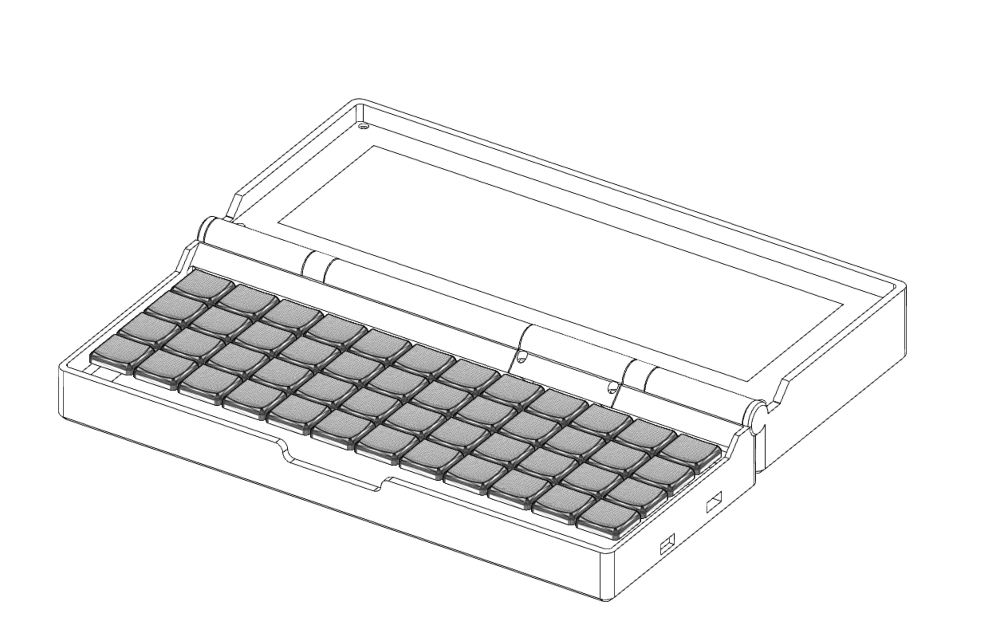
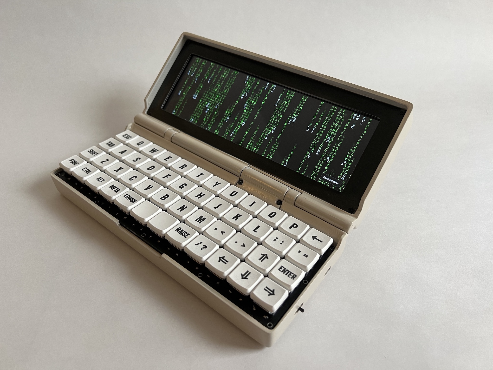
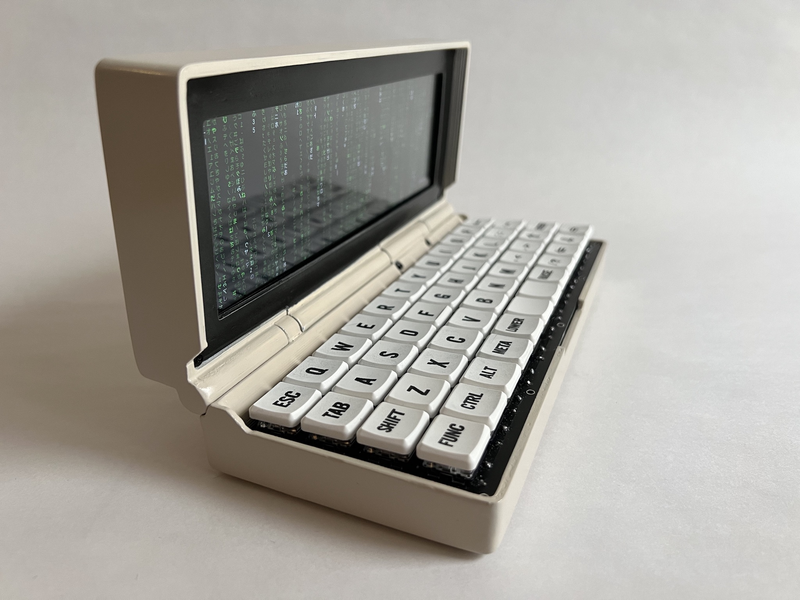
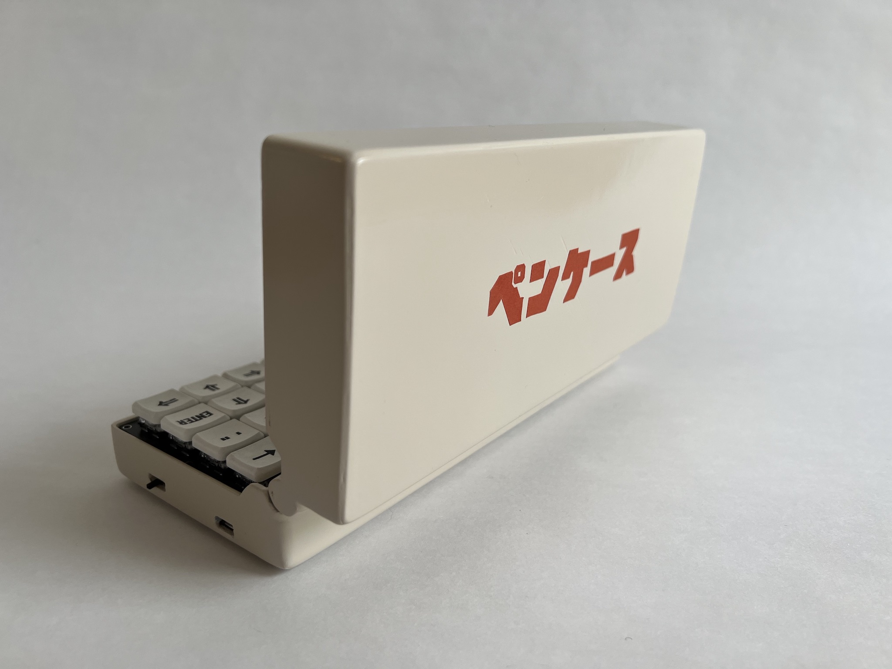
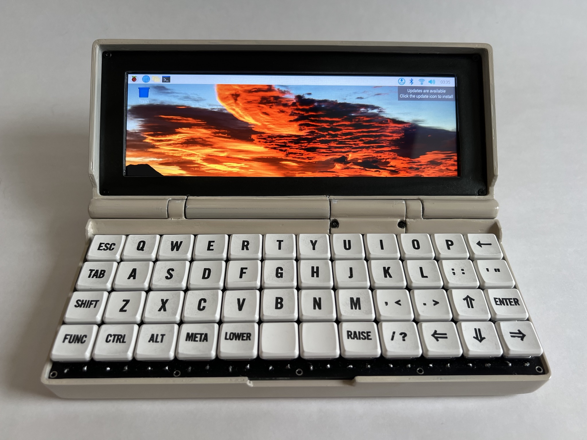
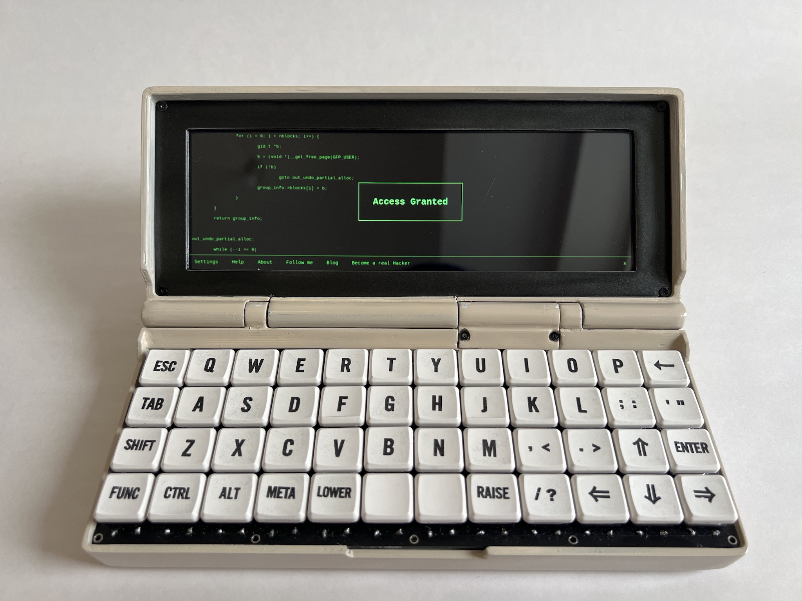
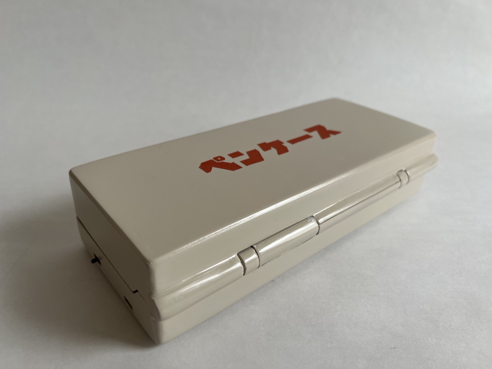

# Penkesu Computer - A Homebrew Retro-style Handheld PC

The Penkēsu (Japanese: `ペンケース`) is a retro-style handheld device powered by a Raspberry Pi Zero 2 W, a 7.9 inch widescreen display (1280 x 400 resolution), and a 48-key ortholinear mechanical keyboard. 

## The Design

The enclosure of the Penkesu Computer is designed around the display and keyboard to ensure (relatively) compact physical dimensions.

Repurposed Gameboy Advance SP hinges and a ribbon cable for HDMI are used to keep the hinge design thin, yet they hold the weight of the display so that it won't tip over.

Electronics are intentionally kept minimal (3 internal components) and most of the parts are either 3D printable or available as off-the-shelf products. 

|  |  | 
|-----------------------------|-----------------------------|
|  |  | 
|  |  | 

See also: the keyboard [sound test video](https://twitter.com/penk/status/1492715339997925376).

## Open Source Hardware 

Ever since the [CutiePi tablet](https://cutiepi.io) was successfully funded and started shipping, I felt the need to work on a new project; something that I didn't need to worry too much about (ie: commercial viability), and to remind myself why I started tinkering. A "rebound" project, so to speak. 

And since there are no immediate plans on selling kits or making the Penkesu Computer mass producible, I wanted to publish all the designs and plans so there's enough information for anyone interested in making one. 

## Bill of Materials 

- Display 
    - Waveshare [7.9inch Capacitive Touch Screen](https://www.waveshare.com/7.9inch-HDMI-LCD.htm)
    - Adafruit DIY HDMI Cable Parts - [Right Angle adapter](https://www.adafruit.com/product/3550), [Mini HDMI adapter](https://www.adafruit.com/product/3552), and [20cm Ribbon Cable](https://www.adafruit.com/product/3561)
- Case 
    - Gameboy Advance SP [Replacement Hinges](https://amazon.com/dp/B00YCEOXIK)
    - 3D printed parts ([STL files](stl) and [STEP file](step)) 
    - M2x6mm screws x 6 (8 if intending to secure the keyboard to the bottom tray. See part 2 below for more info.)
    - M2x6mm threaded heat-set inserts x 6 (8 if intending to secure the keyboard to the bottom tray. See part 2 below for more info.)
- Electronics 
    - Raspberry Pi [Zero 2 W](https://www.raspberrypi.com/products/raspberry-pi-zero-2-w/)
    - 3.7V 606090 (or similar size) [Li-Po battery](https://www.aliexpress.com/wholesale?SearchText=606090+battery)
    - Adafruit [PowerBoost 1000C](https://www.adafruit.com/product/2465)
- Keyboard 
    - Kailh Low Profile [Choc v1](https://www.adafruit.com/product/5114) Switches x 48
    - MBK Choc Low Profile Keycaps x 48
    - 1N4148 Diode x 48 
    - Arduino Pro Micro x 1
    - PCB x 1 ([gerber file](https://github.com/larrbo/odd-rocket/blob/master/koda/koda_no%20silk.zip) and [QMK firmware](firmware))

Links are **not** affiliate links, and only provided as references. 

## Notes on the Keyboard

About the keyboard: 

- The keyboard is called `Koda`, which is originally designed by [larrbo](https://github.com/larrbo/odd-rocket/) and released under Creative Commons BY-NC-SA 4.0 License. I've tweaked the layout so that it better fits my needs and looks closer to the `Planck`. More on this below.
- If one wishes to use a different 40% keyboard for the build, it can be done by editing the STEP file and adjusting the compartment size in the chassis.
- A thin metal sheet was [glued to the base](https://twitter.com/penk/status/1489810591628034048) as the counterweight, your mileage may vary depending on how you like the weight distribution

For the keycaps: 

- The legends on keycaps were [printed with a laser engraver](https://twitter.com/penk/status/1477140916565843968), which I used [black dip powder for nails](https://twitter.com/penk/status/1475763655212138499) as pigment. 
- More information about this method can be found with keywords [laser dye-sub keycaps](https://www.youtube.com/watch?v=qqAspFVRZNk) 
- There are custom printing services for keycaps e.g. [yushakobo.jp](https://shop.yushakobo.jp/collections/services/products/keycap-laser-marking) if one does not have access to a laser engraver.

Keyboard Layout: 

The lower key activates a layer that primarily has number keys from ` to 1 - 0 across the top row (excluding the top right key, which is the backspace key in all layers). 
The raise key activates a layer that has the shifted version of all of the numeral keys from the lower layer. As well as function keys using the tab,a,s,d,f,g and shift,z,x,c,v,b keys for F1-F6 and F7-F12 accordingly. 
Pushing func key down and holding it activates a mouse layer. The mouse layer uses an accelerated mode but allows one to temporarily activate the constant mode using an additional key. As you  might have guessed, when using the accelerated mode the speed of the cursor is initially slow but over time increases in speed. This mode is active as soon as mouse mode is entered. (by holding down the func key) Your w,a,s,d keys are you cursor movement keys. Your left, right, and middle mouse buttons are j,k, and l respectively. Your scroll wheel uses the t,f,g,h keys. Finally mouse cursor speed can be toggled by tapping or by holding. If tapped the keys change the speed of acceleration. If the keys are held they will activate constant mode at the equivalent mousing speed.  There are 3 overall speeds: 0, 1, and 2, with 0 being the slowest and most precise, and 2 being the fasted and most inaccurate. You access speed 0 using the v key. Speed 1 using the b key. And the fastest speed (2) using the n key. 

## The Assembly 

1. Glue the two hinges to the chassis (my 3D printer is not accurate enough to print a functional hinge lock, so I simply glued them with 5 minute epoxy.) You want to make sure that the hinge is able to still turn after the epoxy has set. 

  

2. Add heat-set threaded inserts (M2x6mm) to the 4 corners of screen bezel, and 2 to the hinge cover. You may also use heat insert at the front corners of the keyboard tray. Just note that placing these inserts are very difficult, and not entirely necessary. For ease of access you may wish to not use them at all. 

3. Wrap the ribbon cable twice and pull it out through the hinge cover. If you use a toothpick, it might make it easier to ensure you do this cleanly through the display cover. 

  

4. Wiring: 

    | Component | Pin | 
    |-----------|--------|
    | battery positive | PowerBoost `Bat` pin |
    | battery negative | PowerBoost `GND` pin | 
    | switch 1 pin | PowerBoost `GND` pin | 
    | switch 2 pin | PowerBoost `EN` pin | 
    | PowerBoost `5V OUT` | display and Pi Zero's `VCC` | 
    | PowerBoost `GND` | display and Pi Zero's `GND` |

     

5. Connect the keyboard's micro USB and the display cable into the mini HDMI port of the Pi Zero 2 W; inset the micro SD card into the Pi Zero 2 W. 
6. Fasten all components with M2x6mm screws. 

If you made it this far, you are welcome to check out my other project, [the CutiePi tablet](http://cutiepi.io), which is also 100% open source hardware! :-)

## Copyright and License

Copyright (c) 2022 Penk Chen. All rights reserved.

All files are licensed under MIT license, see the [LICENSE](LICENSE) for more information.
